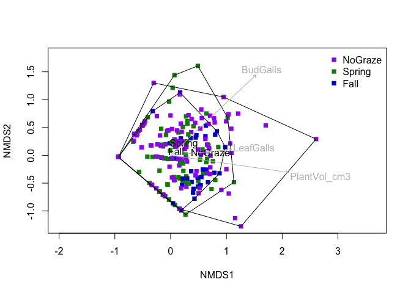

  


#LPI Data

```r
#Import the data
LPIGall<-read.csv("Gall_LPI_2023_1.csv", stringsAsFactors=T)
str(LPIGall)
```

```
## 'data.frame':	750 obs. of  10 variables:
##  $ Date       : Factor w/ 7 levels "6/12/23","6/13/23",..: 5 5 5 5 5 5 5 5 5 5 ...
##  $ PastureID  : Factor w/ 7 levels "1A","1B","2A",..: 2 2 2 2 2 2 2 2 2 2 ...
##  $ Transect   : int  5 5 5 5 5 5 5 5 5 5 ...
##  $ Point      : int  1 2 3 4 5 6 7 8 9 10 ...
##  $ TopLayer   : Factor w/ 12 levels "AF","AG","ARTR4",..: 10 7 1 9 9 9 9 1 9 9 ...
##  $ LowerLayer1: Factor w/ 14 levels "","AF","AG","ARTR4",..: 5 5 5 5 5 5 5 1 5 5 ...
##  $ LowerLayer2: Factor w/ 12 levels "","AF","AG","CHVI8",..: 1 1 1 1 1 1 1 1 1 1 ...
##  $ LowerLayer3: Factor w/ 3 levels "","AF","L": 1 1 1 1 1 1 1 1 1 1 ...
##  $ LowerLayer4: Factor w/ 2 levels "","L": 1 1 1 1 1 1 1 1 1 1 ...
##  $ SoilSurface: Factor w/ 11 levels "AG","ARTR4","LC",..: 10 10 10 7 10 10 7 10 7 10 ...
```

```r
#add treatment columns
LPIGall <- dplyr::mutate(LPIGall,
                           Fire = ifelse(PastureID == "1B" | PastureID == "2B" | PastureID == "EX-2B" | PastureID == "EX-1B",
                                         "Burn", "NoBurn"),
                           Graze = ifelse(PastureID == "1B" | PastureID == "2A", "Spring",
                                          ifelse(PastureID == "1A" | PastureID == "2B", "Fall", "NoGraze")))
LPIGall <- dplyr::relocate(LPIGall, c(Fire, Graze), .after = PastureID)
LPIGall$TopLayerCount<-1
str(LPIGall)
```

```
## 'data.frame':	750 obs. of  13 variables:
##  $ Date         : Factor w/ 7 levels "6/12/23","6/13/23",..: 5 5 5 5 5 5 5 5 5 5 ...
##  $ PastureID    : Factor w/ 7 levels "1A","1B","2A",..: 2 2 2 2 2 2 2 2 2 2 ...
##  $ Fire         : chr  "Burn" "Burn" "Burn" "Burn" ...
##  $ Graze        : chr  "Spring" "Spring" "Spring" "Spring" ...
##  $ Transect     : int  5 5 5 5 5 5 5 5 5 5 ...
##  $ Point        : int  1 2 3 4 5 6 7 8 9 10 ...
##  $ TopLayer     : Factor w/ 12 levels "AF","AG","ARTR4",..: 10 7 1 9 9 9 9 1 9 9 ...
##  $ LowerLayer1  : Factor w/ 14 levels "","AF","AG","ARTR4",..: 5 5 5 5 5 5 5 1 5 5 ...
##  $ LowerLayer2  : Factor w/ 12 levels "","AF","AG","CHVI8",..: 1 1 1 1 1 1 1 1 1 1 ...
##  $ LowerLayer3  : Factor w/ 3 levels "","AF","L": 1 1 1 1 1 1 1 1 1 1 ...
##  $ LowerLayer4  : Factor w/ 2 levels "","L": 1 1 1 1 1 1 1 1 1 1 ...
##  $ SoilSurface  : Factor w/ 11 levels "AG","ARTR4","LC",..: 10 10 10 7 10 10 7 10 7 10 ...
##  $ TopLayerCount: num  1 1 1 1 1 1 1 1 1 1 ...
```

```r
#summarize it by treatment

LPIGall<-LPIGall%>%dplyr::select(Transect, PastureID, Fire, Graze, TopLayer,TopLayerCount)
  
  GallSum<-LPIGall%>%
  group_by(Transect,Fire, Graze)%>%
  pivot_wider(names_from=TopLayer, 
              values_from=TopLayerCount,
              values_fn=sum,
              values_fill=0)
  write.csv(GallSum, "summarytophitcover.csv")
  
              

 GallSum<-GallSum%>%group_by(Transect,Fire,Graze)%>%
   mutate(ShrubTotal=(PUTR2+ARTR4+TECA2+CHVI+CHVI8))%>%
   mutate(TotalCover=(ShrubTotal+AF+PG+AG+PF))%>%
   mutate(PercentShrubCover=ShrubTotal/TotalCover*100)%>%
   mutate(PercentAFCover=AF/TotalCover*100, 
          PercentPFCover=PF/TotalCover*100,
          PercentPGCover=PG/TotalCover*100,
          PercentAGCover=AG/TotalCover*100,
          PercentARTR4Cover=ARTR4/TotalCover*100) %>%
   mutate(PercentShrubCover+PercentPFCover+PercentPGCover+PercentAGCover)
write.csv(GallSum, "functionalGroupCover.csv")

GallSumLong<-GallSum%>%group_by(Transect,Fire,Graze)%>%pivot_longer(cols=PercentShrubCover:PercentAGCover,
                                                           names_to="CoverType",
                                                           values_to="CoverPercent")
GallSumLong
```

```
## # A tibble: 150 × 22
## # Groups:   Transect, Fire, Graze [29]
##    Transect PastureID Fire  Graze  PUTR2  none    AF    PG    PF ARTR4 TECA2
##       <int> <fct>     <chr> <chr>  <dbl> <dbl> <dbl> <dbl> <dbl> <dbl> <dbl>
##  1        5 1B        Burn  Spring     2     4     5    14     0     0     0
##  2        5 1B        Burn  Spring     2     4     5    14     0     0     0
##  3        5 1B        Burn  Spring     2     4     5    14     0     0     0
##  4        5 1B        Burn  Spring     2     4     5    14     0     0     0
##  5        5 1B        Burn  Spring     2     4     5    14     0     0     0
##  6        4 1B        Burn  Spring     0     7     2     7     1     7     1
##  7        4 1B        Burn  Spring     0     7     2     7     1     7     1
##  8        4 1B        Burn  Spring     0     7     2     7     1     7     1
##  9        4 1B        Burn  Spring     0     7     2     7     1     7     1
## 10        4 1B        Burn  Spring     0     7     2     7     1     7     1
## # ℹ 140 more rows
## # ℹ 11 more variables: AG <dbl>, CHVI <dbl>, CHVI8 <dbl>, SD <dbl>, M <dbl>,
## #   ShrubTotal <dbl>, TotalCover <dbl>, PercentARTR4Cover <dbl>,
## #   `PercentShrubCover + PercentPFCover + PercentPGCover + PercentAGCover` <dbl>,
## #   CoverType <chr>, CoverPercent <dbl>
```

```r
library(ggplot2)
library(RColorBrewer)
ggplot(GallSumLong, aes(x = Graze, y = CoverPercent, fill = CoverType)) + 
  geom_bar(stat="identity") + facet_grid(cols = vars(Fire))+
                                      # Apply scale_colour_brewer function
  scale_fill_brewer(palette = "PiYG")
```

<!-- -->

```r
ggsave("CoverFunctionalGroup.png")
```

```
## Saving 7 x 5 in image
```

```r
GallSum$TotalCover
```

```
##  [1] 21 18 15 16 13 21 18 13 21 18 21 21 15 21 20 22 19 22 22 19 19 20 11 18 14
## [26] 20 19 19 15 20
```

```r
colnames(GallSumLong)
```

```
##  [1] "Transect"                                                            
##  [2] "PastureID"                                                           
##  [3] "Fire"                                                                
##  [4] "Graze"                                                               
##  [5] "PUTR2"                                                               
##  [6] "none"                                                                
##  [7] "AF"                                                                  
##  [8] "PG"                                                                  
##  [9] "PF"                                                                  
## [10] "ARTR4"                                                               
## [11] "TECA2"                                                               
## [12] "AG"                                                                  
## [13] "CHVI"                                                                
## [14] "CHVI8"                                                               
## [15] "SD"                                                                  
## [16] "M"                                                                   
## [17] "ShrubTotal"                                                          
## [18] "TotalCover"                                                          
## [19] "PercentARTR4Cover"                                                   
## [20] "PercentShrubCover + PercentPFCover + PercentPGCover + PercentAGCover"
## [21] "CoverType"                                                           
## [22] "CoverPercent"
```

```r
ARTR4Coverdf<-GallSumLong%>%select(Transect, PastureID, PercentARTR4Cover)
```

```
## Adding missing grouping variables: `Fire`, `Graze`
```

```r
## Gall Data Analysis
```

#Gall Data


```r
# load data
gall_data <- readxl::read_xlsx("./Gall Data '23.xlsx", sheet = "Gall Data")

# overview df
str(gall_data)
```

```
## tibble [484 × 28] (S3: tbl_df/tbl/data.frame)
##  $ Date                           : POSIXct[1:484], format: "2023-06-05" "2023-06-05" ...
##  $ Pasture ID                     : chr [1:484] "1B" "1B" "1B" "1B" ...
##  $ Transect #                     : num [1:484] 1 1 1 1 1 1 2 2 3 3 ...
##  $ Transect side                  : chr [1:484] "E" "E" "W" "W" ...
##  $ Point (m)                      : num [1:484] 1 0 23 22 12 2 9 0 14 14 ...
##  $ Point (cm)                     : num [1:484] 0 50 45 5 60 40 15 75 15 60 ...
##  $ Dist. from transect (cm)       : num [1:484] 100 62 75 56 97 97 67 40 60 25 ...
##  $ Width (cm)                     : num [1:484] 117 34 15 49 31 108 15 25 26 19 ...
##  $ Cross (cm)                     : num [1:484] 114 31 8 31 30 99 12 22 18 11 ...
##  $ Height (cm)                    : num [1:484] 51 22 12 25 23 43 12 27 21 17 ...
##  $ Host Species                   : chr [1:484] "ARTR4" "ARTR4" "ARTR4" "ARTR4" ...
##  $ Daisy Gall                     : num [1:484] NA NA 3 16 9 38 3 NA 2 2 ...
##  $ Fuzzy Ball Gall                : num [1:484] NA NA NA NA NA 9 NA 1 1 NA ...
##  $ Smooth Ball Gall               : num [1:484] NA NA NA NA NA NA NA NA NA NA ...
##  $ Multiocular Ball Gall          : num [1:484] NA NA NA NA NA NA NA NA NA NA ...
##  $ Medusa Gall                    : num [1:484] NA NA NA NA NA 2 NA NA NA NA ...
##  $ Echidna Gall                   : num [1:484] NA NA NA NA NA NA NA NA NA NA ...
##  $ Teeny Tiny Leaf Gall           : num [1:484] NA NA NA NA NA NA NA NA NA NA ...
##  $ Bud Gall                       : num [1:484] 1 NA NA NA NA 2 NA NA 4 NA ...
##  $ Tiny Bud Gall (Vase)           : num [1:484] 3 NA NA NA NA NA NA NA NA NA ...
##  $ Bunny Ears Gall                : num [1:484] NA NA NA NA NA NA NA NA NA NA ...
##  $ Stem Gall                      : num [1:484] NA NA NA NA NA NA NA NA NA NA ...
##  $ Thorn Gall                     : num [1:484] NA NA NA NA NA NA NA NA NA NA ...
##  $ Teeny Tiny Baby Fuzzy Ball Gall: num [1:484] NA NA NA NA NA NA NA NA NA NA ...
##  $ Baby Bunny Ears Gall           : num [1:484] NA NA NA NA NA NA NA NA NA NA ...
##  $ Bulbous Stem                   : num [1:484] NA NA NA NA NA NA NA NA NA NA ...
##  $ Flat Daisy                     : num [1:484] NA NA NA NA NA NA NA NA NA NA ...
##  $ Green thorn                    : num [1:484] NA NA NA NA NA NA NA NA NA NA ...
```

```r
# remove special characters from column names
colnames(gall_data) <- gsub(" ", "", colnames(gall_data))
colnames(gall_data) <- gsub("\\(", "_", colnames(gall_data))
colnames(gall_data) <- gsub("\\)", "", colnames(gall_data))

## - format variables
# turn pasture id, transect side, host species into factors
gall_data <- dplyr::mutate(gall_data,
                           PastureID = as.factor(PastureID),
                           Transectside = as.factor(Transectside),
                           HostSpecies = as.factor(HostSpecies))

# add columns for each treatment type
gall_data <- dplyr::mutate(gall_data,
                           Fire = factor(ifelse(PastureID == "1B" | PastureID == "2B" | PastureID == "EX-2B" | PastureID == "EX-1B",
                                                "Burn", "NoBurn"), levels = c("NoBurn", "Burn")),
                           Graze = factor(ifelse(PastureID == "1B" | PastureID == "2A", "Spring",
                                                 ifelse(PastureID == "1A" | PastureID == "2B", "Fall", "NoGraze")), 
                                          levels = c("NoGraze", "Spring", "Fall")),
                           Treatment = factor(paste0(Graze, "_", Fire), 
                                              levels = c("NoGraze_NoBurn", "Spring_NoBurn", "Fall_NoBurn",
                                                         "NoGraze_Burn", "Spring_Burn", "Fall_Burn")))
gall_data <- dplyr::relocate(gall_data, c(Fire, Graze, Treatment), .after = PastureID)

# replace NA values
gall_data <- dplyr::mutate_at(gall_data, vars(DaisyGall:Greenthorn), ~replace_na(., 0))

# add col for volume of plant
gall_data <- dplyr::mutate(gall_data, PlantVol_cm3 = Width_cm * Height_cm * Cross_cm * pi/6) 
gall_data <- dplyr::relocate(gall_data, PlantVol_cm3, .after = Height_cm)

# add gall totals
galls <- dplyr::select(gall_data, c(DaisyGall:Greenthorn))
gall_data$GallTotal <- rowSums(galls)

# add galls per plant volume
gall_data <- gall_data %>%
  dplyr::filter(PlantVol_cm3 != 0) %>% # remove two rows with vol=0
  dplyr::mutate(GallperVol = GallTotal/PlantVol_cm3) # calculate galls by plant vol

# add plant density
density_df <- readxl::read_xlsx("./Gall Data '23.xlsx", sheet = "Summary gall data")
density_df <- density_df %>%
  dplyr::select(c(PastureID, Transect, PlantTotal, TransectArea_m2)) %>%
  dplyr::mutate(Plants_m2 = PlantTotal / TransectArea_m2)

gall_data$Transect<-gall_data$`Transect#`
gall_data$`Transect#`=NULL
gall_data <- gall_data %>%
  dplyr::left_join(density_df, by = c("PastureID", "Transect"))

# check the data again
str(gall_data)
```

```
## tibble [482 × 37] (S3: tbl_df/tbl/data.frame)
##  $ Date                      : POSIXct[1:482], format: "2023-06-05" "2023-06-05" ...
##  $ PastureID                 : chr [1:482] "1B" "1B" "1B" "1B" ...
##  $ Fire                      : Factor w/ 2 levels "NoBurn","Burn": 2 2 2 2 2 2 2 2 2 2 ...
##  $ Graze                     : Factor w/ 3 levels "NoGraze","Spring",..: 2 2 2 2 2 2 2 2 2 2 ...
##  $ Treatment                 : Factor w/ 6 levels "NoGraze_NoBurn",..: 5 5 5 5 5 5 5 5 5 5 ...
##  $ Transectside              : Factor w/ 3 levels "0","E","W": 2 2 3 3 3 3 2 3 2 2 ...
##  $ Point_m                   : num [1:482] 1 0 23 22 12 2 9 0 14 14 ...
##  $ Point_cm                  : num [1:482] 0 50 45 5 60 40 15 75 15 60 ...
##  $ Dist.fromtransect_cm      : num [1:482] 100 62 75 56 97 97 67 40 60 25 ...
##  $ Width_cm                  : num [1:482] 117 34 15 49 31 108 15 25 26 19 ...
##  $ Cross_cm                  : num [1:482] 114 31 8 31 30 99 12 22 18 11 ...
##  $ Height_cm                 : num [1:482] 51 22 12 25 23 43 12 27 21 17 ...
##  $ PlantVol_cm3              : num [1:482] 356172 12141 754 19884 11200 ...
##  $ HostSpecies               : Factor w/ 4 levels "0","ARTR4","hybrid",..: 2 2 2 2 2 2 2 2 2 2 ...
##  $ DaisyGall                 : num [1:482] 0 0 3 16 9 38 3 0 2 2 ...
##  $ FuzzyBallGall             : num [1:482] 0 0 0 0 0 9 0 1 1 0 ...
##  $ SmoothBallGall            : num [1:482] 0 0 0 0 0 0 0 0 0 0 ...
##  $ MultiocularBallGall       : num [1:482] 0 0 0 0 0 0 0 0 0 0 ...
##  $ MedusaGall                : num [1:482] 0 0 0 0 0 2 0 0 0 0 ...
##  $ EchidnaGall               : num [1:482] 0 0 0 0 0 0 0 0 0 0 ...
##  $ TeenyTinyLeafGall         : num [1:482] 0 0 0 0 0 0 0 0 0 0 ...
##  $ BudGall                   : num [1:482] 1 0 0 0 0 2 0 0 4 0 ...
##  $ TinyBudGall_Vase          : num [1:482] 3 0 0 0 0 0 0 0 0 0 ...
##  $ BunnyEarsGall             : num [1:482] 0 0 0 0 0 0 0 0 0 0 ...
##  $ StemGall                  : num [1:482] 0 0 0 0 0 0 0 0 0 0 ...
##  $ ThornGall                 : num [1:482] 0 0 0 0 0 0 0 0 0 0 ...
##  $ TeenyTinyBabyFuzzyBallGall: num [1:482] 0 0 0 0 0 0 0 0 0 0 ...
##  $ BabyBunnyEarsGall         : num [1:482] 0 0 0 0 0 0 0 0 0 0 ...
##  $ BulbousStem               : num [1:482] 0 0 0 0 0 0 0 0 0 0 ...
##  $ FlatDaisy                 : num [1:482] 0 0 0 0 0 0 0 0 0 0 ...
##  $ Greenthorn                : num [1:482] 0 0 0 0 0 0 0 0 0 0 ...
##  $ GallTotal                 : num [1:482] 4 0 3 16 9 51 3 1 7 2 ...
##  $ GallperVol                : num [1:482] 1.12e-05 0.00 3.98e-03 8.05e-04 8.04e-04 ...
##  $ Transect                  : num [1:482] 1 1 1 1 1 1 2 2 3 3 ...
##  $ PlantTotal                : num [1:482] 6 6 6 6 6 6 2 2 13 13 ...
##  $ TransectArea_m2           : num [1:482] 50 50 50 50 50 50 50 50 50 50 ...
##  $ Plants_m2                 : num [1:482] 0.12 0.12 0.12 0.12 0.12 0.12 0.04 0.04 0.26 0.26 ...
```

```r
# create pivot df for plotting
gall_long_df <- gall_data %>%
  pivot_longer(cols = c(DaisyGall:Greenthorn),
               names_to = "GallType",
               values_to = "GallCount") %>%
  mutate(GallCountperVol = GallCount / PlantVol_cm3,
         GallPercent = GallCount / GallTotal,
         GallPercentperVol = GallPercent * PlantVol_cm3,
         GallCount_m2 = GallCount * Plants_m2) %>%
  mutate(across(GallPercent:GallPercentperVol, ~ replace(., is.nan(.), 0)))
```


########
##Treatment Effects on Gall Abundance
########

```r
## How many plants have galls?

# create a binary factor for presence/absence of galls on a plant
gall_binary <- gall_data %>%
  dplyr::mutate(GallsPresent = factor(ifelse(GallTotal == 0, "No", "Yes")))

# summarise presence/absence per individual treatment, and across combination treatment
gall_binary %>%
  dplyr::group_by(Fire, GallsPresent) %>%
  dplyr::summarize(PlantCount = n()) %>%
  dplyr::mutate(Prop = PlantCount / sum(PlantCount))
```

```
## `summarise()` has grouped output by 'Fire'. You can override using the
## `.groups` argument.
```

```
## # A tibble: 4 × 4
## # Groups:   Fire [2]
##   Fire   GallsPresent PlantCount  Prop
##   <fct>  <fct>             <int> <dbl>
## 1 NoBurn No                   88 0.241
## 2 NoBurn Yes                 277 0.759
## 3 Burn   No                   14 0.120
## 4 Burn   Yes                 103 0.880
```

```r
gall_binary %>%
  dplyr::group_by(Graze, GallsPresent) %>%
  dplyr::summarize(PlantCount = n()) %>%
  dplyr::mutate(Prop = PlantCount / sum(PlantCount))
```

```
## `summarise()` has grouped output by 'Graze'. You can override using the
## `.groups` argument.
```

```
## # A tibble: 6 × 4
## # Groups:   Graze [3]
##   Graze   GallsPresent PlantCount  Prop
##   <fct>   <fct>             <int> <dbl>
## 1 NoGraze No                   19 0.122
## 2 NoGraze Yes                 137 0.878
## 3 Spring  No                   33 0.189
## 4 Spring  Yes                 142 0.811
## 5 Fall    No                   50 0.331
## 6 Fall    Yes                 101 0.669
```

```r
gall_presence <- gall_binary %>%
  dplyr::group_by(Treatment, GallsPresent) %>%
  dplyr::summarize(PlantCount = n()) %>%
  dplyr::mutate(Prop = round(PlantCount / sum(PlantCount), 3)) %>%
  dplyr::mutate(GallsPresent = ifelse(GallsPresent ==0, "No", "Yes"))
```

```
## `summarise()` has grouped output by 'Treatment'. You can override using the
## `.groups` argument.
```
###Example of making a pretty table. 


```r
# See kableExtra user guide for more options: https://cran.r-project.org/web/packages/kableExtra/vignettes/awesome_table_in_html.html
gall_presence %>%
  kbl(caption = "Gall Presence by Treatment") %>% # create table and give it a title
  kable_classic_2(full_width = F) %>%  # formatting
  save_kable("./viz/gall_presence_table.png")  # save it as a .png file
```

```
## Warning in file.create(file): cannot create file
## './viz/gall_presence_table.png', reason 'No such file or directory'
```

```
## Warning in normalizePath(file): path[1]="./viz/gall_presence_table.png": No
## such file or directory
```

```
## PhantomJS not found. You can install it with webshot::install_phantomjs(). If it is installed, please make sure the phantomjs executable can be found via the PATH variable.
```

```
## Warning in file.remove(file): cannot remove file
## './viz/gall_presence_table.png', reason 'No such file or directory'
```

```
## save_kable could not create image with webshot package. Please check for any webshot messages
```

###make plots of presence/absence

```r
ggplot(gall_binary, aes(x = GallsPresent, fill = Fire)) + 
  geom_bar(position = "dodge") + 
  theme_bw() + scale_fill_startrek() + 
  facet_wrap(vars(Graze)) + 
  labs(x = "Galls Present", y = "Plant Count", title = "Gall Presence by Treatment")
```

<!-- -->

```r
ggplot(gall_binary, aes(x = GallsPresent, fill = Graze)) + 
  geom_bar(position = "dodge") + 
  theme_bw() + scale_fill_startrek() + 
  facet_wrap(vars(Fire)) + 
  labs(x = "Galls Present", y = "Plant Count", title = "Gall Presence by Treatment")
```

<!-- -->

```r
ggplot(gall_binary, aes(x = GallsPresent, fill = as.factor(Transect))) + 
  geom_bar(position = "dodge") + 
  theme_bw() + scale_fill_startrek() + 
  facet_wrap(vars(Treatment)) + 
  labs(x = "Galls Present", y = "Plant Count", title = "Gall Presence by Treatment, Transect")
```

<!-- -->


###Search for some patterns

```r
###Does total number of galls per plant vary by treatment?

gall_totals <- gall_data %>% 
  dplyr::group_by(Fire, Graze, Treatment) %>% 
  dplyr::summarize(GallTotal = sum(GallTotal), PlantTotal = n(), 
                   TotalPlantVol = sum(PlantVol_cm3), MeanPlantVol = mean(PlantVol_cm3), sdPlantVol = sd(PlantVol_cm3),
                   MeanPlantDensity = mean(GallperVol), sdPlantDensity = sd(GallperVol)) %>%
  dplyr::mutate(MeanGallsperPlant = GallTotal / PlantTotal) # calculate galls per plant to account for dif sample sizes
```

```
## `summarise()` has grouped output by 'Fire', 'Graze'. You can override using the
## `.groups` argument.
```

```r
# make table of gall totals
gall_totals %>%
  select(!Treatment) %>%
  relocate(MeanGallsperPlant, .after = PlantTotal) %>%
  kbl(caption = "Gall Summary by Treatment") %>%
  kable_minimal(full_width = F) %>%
  save_kable("./viz/gall_summary_table.png")
```

```
## Warning in file.create(file): cannot create file
## './viz/gall_summary_table.png', reason 'No such file or directory'
```

```
## Warning in normalizePath(file): path[1]="./viz/gall_summary_table.png": No such
## file or directory
```

```
## PhantomJS not found. You can install it with webshot::install_phantomjs(). If it is installed, please make sure the phantomjs executable can be found via the PATH variable.
```

```
## Warning in file.remove(file): cannot remove file
## './viz/gall_summary_table.png', reason 'No such file or directory'
```

```
## save_kable could not create image with webshot package. Please check for any webshot messages
```

```r
# perform Kruskal-Wallis rank sum test for significant differences in gall totals by treatment
# Note: Kruskal-Wallis test is a non-parametric test comparable to ANOVA, but does not make any underlying assumptions (ie linearity, normality) about the data
kruskal.test(GallTotal ~ Fire, data = gall_totals)
```

```
## 
## 	Kruskal-Wallis rank sum test
## 
## data:  GallTotal by Fire
## Kruskal-Wallis chi-squared = 0.42857, df = 1, p-value = 0.5127
```

```r
kruskal.test(GallTotal ~ Graze, data = gall_totals)
```

```
## 
## 	Kruskal-Wallis rank sum test
## 
## data:  GallTotal by Graze
## Kruskal-Wallis chi-squared = 3.4286, df = 2, p-value = 0.1801
```

```r
kruskal.test(GallTotal ~ Treatment, data = gall_totals)
```

```
## 
## 	Kruskal-Wallis rank sum test
## 
## data:  GallTotal by Treatment
## Kruskal-Wallis chi-squared = 5, df = 5, p-value = 0.4159
```

```r
kruskal.test(MeanGallsperPlant ~ Fire, data = gall_totals)
```

```
## 
## 	Kruskal-Wallis rank sum test
## 
## data:  MeanGallsperPlant by Fire
## Kruskal-Wallis chi-squared = 0.047619, df = 1, p-value = 0.8273
```

```r
kruskal.test(MeanGallsperPlant ~ Graze, data = gall_totals)
```

```
## 
## 	Kruskal-Wallis rank sum test
## 
## data:  MeanGallsperPlant by Graze
## Kruskal-Wallis chi-squared = 2.5714, df = 2, p-value = 0.2765
```

```r
kruskal.test(MeanGallsperPlant ~ Treatment, data = gall_totals)
```

```
## 
## 	Kruskal-Wallis rank sum test
## 
## data:  MeanGallsperPlant by Treatment
## Kruskal-Wallis chi-squared = 5, df = 5, p-value = 0.4159
```

```r
# no significant differences identified

# frequency plot of gall totals by treatment   
ggplot(gall_data, aes(x = GallTotal, fill = Treatment)) + 
  geom_histogram(binwidth = 10, alpha = 0.5) + 
  theme_bw() + 
  labs(x = "Gall Total", y = "Plant Count", title = "Gall Total per Plant, by Treatment")
```

<!-- -->

```r
# density plot of gall totals by treatment (to account for different sample sizes)   
ggplot(gall_data, aes(x = GallTotal, after_stat(density), color = Treatment)) + 
  geom_freqpoly(binwidth = 50, lwd = 1.2, alpha = 0.5) + 
  theme_bw() + 
  labs(x = "Gall Total", y = "Plant Count Density", title = "Gall Total per Plant")
```

<!-- -->

```r
#---#

## Do gall totals vary between transects within treatment?
galltotals_transect <- gall_data %>%
  dplyr::select(c(Fire, Graze, Treatment, Transect, PlantVol_cm3, GallTotal, GallperVol, Plants_m2)) %>%
  group_by(Treatment, Transect, Fire, Graze) %>%  # you could add Transectside as a grouping variable to check if transect side is important
  dplyr::summarise(meanPlantVol = mean(PlantVol_cm3), 
                   meanGalls = mean(GallTotal), 
                   meanGallperVol = mean(GallperVol),
                   sumGallperTransect=sum(GallTotal),
                   ARTR4Density=mean(Plants_m2)) %>%
  dplyr::arrange(Treatment, Transect)
```

```
## `summarise()` has grouped output by 'Treatment', 'Transect', 'Fire'. You can
## override using the `.groups` argument.
```

```r
# Test for differences of gall totals within treatment between transects
gall_data %>% group_by(Treatment) %>% rstatix::kruskal_test(GallTotal ~ Transect) # Note: p-value of true significance is .05 / 6 = .0083 (6 levels)
```

```
## # A tibble: 6 × 7
##   Treatment      .y.           n statistic    df         p method        
## * <fct>          <chr>     <int>     <dbl> <int>     <dbl> <chr>         
## 1 NoGraze_NoBurn GallTotal   125    28.5       4 0.0000101 Kruskal-Wallis
## 2 Spring_NoBurn  GallTotal   125    19.7       4 0.000569  Kruskal-Wallis
## 3 Fall_NoBurn    GallTotal   115    14.6       4 0.00573   Kruskal-Wallis
## 4 NoGraze_Burn   GallTotal    31    11.0       3 0.0115    Kruskal-Wallis
## 5 Spring_Burn    GallTotal    50     9.04      4 0.0602    Kruskal-Wallis
## 6 Fall_Burn      GallTotal    36     0.799     3 0.85      Kruskal-Wallis
```

```r
gall_data %>% group_by(Fire) %>% rstatix::kruskal_test(GallTotal ~ Transect) # Note: p-value of true significance is .05 / 2 = .025 (2 levels)
```

```
## # A tibble: 2 × 7
##   Fire   .y.           n statistic    df            p method        
## * <fct>  <chr>     <int>     <dbl> <int>        <dbl> <chr>         
## 1 NoBurn GallTotal   365      39.4     4 0.0000000589 Kruskal-Wallis
## 2 Burn   GallTotal   117      12.1     4 0.017        Kruskal-Wallis
```

```r
gall_data %>% group_by(Graze) %>% rstatix::kruskal_test(GallTotal ~ Transect) # Note: p-value of true significance is .05 / 3 = .017 (3 levels)
```

```
## # A tibble: 3 × 7
##   Graze   .y.           n statistic    df           p method        
## * <fct>   <chr>     <int>     <dbl> <int>       <dbl> <chr>         
## 1 NoGraze GallTotal   156     37.6      4 0.000000134 Kruskal-Wallis
## 2 Spring  GallTotal   175     15.9      4 0.00314     Kruskal-Wallis
## 3 Fall    GallTotal   151      3.19     4 0.526       Kruskal-Wallis
```

```r
# Test for differences of gall per plant volumne within treatment between transects
# Note: p-value of true significance is .05 / 6 = .0083 (6 treatments)
gall_data %>% group_by(Treatment) %>% rstatix::kruskal_test(GallperVol ~ Transect)
```

```
## # A tibble: 6 × 7
##   Treatment      .y.            n statistic    df       p method        
## * <fct>          <chr>      <int>     <dbl> <int>   <dbl> <chr>         
## 1 NoGraze_NoBurn GallperVol   125     19.0      4 0.00077 Kruskal-Wallis
## 2 Spring_NoBurn  GallperVol   125      7.68     4 0.104   Kruskal-Wallis
## 3 Fall_NoBurn    GallperVol   115      7.33     4 0.119   Kruskal-Wallis
## 4 NoGraze_Burn   GallperVol    31      4.49     3 0.213   Kruskal-Wallis
## 5 Spring_Burn    GallperVol    50     13.2      4 0.0102  Kruskal-Wallis
## 6 Fall_Burn      GallperVol    36      1.87     3 0.6     Kruskal-Wallis
```

```r
gall_data %>% group_by(Fire) %>% rstatix::kruskal_test(GallperVol ~ Transect)
```

```
## # A tibble: 2 × 7
##   Fire   .y.            n statistic    df         p method        
## * <fct>  <chr>      <int>     <dbl> <int>     <dbl> <chr>         
## 1 NoBurn GallperVol   365      23.8     4 0.0000884 Kruskal-Wallis
## 2 Burn   GallperVol   117      13.7     4 0.00843   Kruskal-Wallis
```

```r
gall_data %>% group_by(Graze) %>% rstatix::kruskal_test(GallperVol ~ Transect)
```

```
## # A tibble: 3 × 7
##   Graze   .y.            n statistic    df       p method        
## * <fct>   <chr>      <int>     <dbl> <int>   <dbl> <chr>         
## 1 NoGraze GallperVol   156     16.0      4 0.00296 Kruskal-Wallis
## 2 Spring  GallperVol   175     16.5      4 0.00245 Kruskal-Wallis
## 3 Fall    GallperVol   151      3.38     4 0.497   Kruskal-Wallis
```

```r
# patterns look similar between measures of total galls and galls per volume

# visualize gall totals within treatment by transect
ggplot(gall_data, aes(x = Transect, y = GallTotal)) + 
  geom_col() + 
  facet_wrap(vars(Treatment)) +
  scale_fill_aaas() + 
  theme_bw() + 
  ggtitle("Gall Total By Treatment, Transect")
```

<!-- -->

```r
# most galls come from east side of transects

#---#

# get number of gall types
n_galls <- length(unique(gall_long_df$GallType))

# average galls per plant by gall type, treatment
gall_type_counts <- gall_long_df %>%
  dplyr::group_by(Fire, Graze, GallType) %>%
  dplyr::summarize(TotalCount = sum(GallCount), MeanCount = mean(GallCount), sdCount = sd(GallCount),
                   TotalDensity = sum(GallCount)/sum(PlantVol_cm3), MeanDensity = mean(GallCountperVol), sdDensity = sd(GallCountperVol),
                   MeanPercent = mean(GallPercent), sdPercent = sd(GallPercent), 
                   MeanPercentperVol = mean(GallPercentperVol), sdPercentperVol = sd(GallPercentperVol))
```

```
## `summarise()` has grouped output by 'Fire', 'Graze'. You can override using the
## `.groups` argument.
```

```r
# playing with colors and themes in plots
# gall counts by treatment
ggplot(gall_long_df, aes(x = Graze, y = GallCount, fill = GallType)) + 
  geom_col() + 
  facet_grid(cols = vars(Fire), scales = "free_x") + 
  theme_bw() +
  theme(axis.text.x = element_text(angle=45, hjust = 1)) +
  scale_fill_ucscgb() +
  ggtitle("Total Galls by Treatment and Gall Type")
```

<!-- -->

```r
ggplot(gall_long_df, aes(x = Graze, y = GallPercentperVol, fill = GallType)) + 
  geom_col() + 
  facet_grid(cols = vars(Fire), scales = "free_x") + 
  theme_bw() +
  theme(axis.text.x = element_text(angle=45, hjust = 1)) +
  scale_fill_ucscgb() +
  labs(x = "Treament", y = "Gall Count per cm^3")+ 
  ggtitle("Gall per Plant Density by Treatment and Gall Type")
```

<!-- -->

```r
ggplot(gall_long_df, aes(x = Treatment, y = GallCount, fill = GallType)) + 
  geom_col() + 
  facet_grid(cols = vars(Graze), scales = "free_x") + 
  theme_bw() +
  theme(axis.text.x = element_text(angle=45, hjust = 1)) +
  scale_fill_ucscgb() +
  ggtitle("Total Galls by Treatment and Gall Type")
```

<!-- -->

```r
# call counts by fire treatment
ggplot(gall_long_df, aes(x = Fire, y = GallCount, fill = GallType)) + 
  geom_col() + 
  theme_minimal() +
  scale_fill_igv(palette = "default") +
  ggtitle("Total Galls per Fire Treatment, by Gall Type")
```

<!-- -->

```r
# gall counts by graze treatment
ggplot(gall_long_df, aes(x = Graze, y = GallCount, fill = GallType)) + 
  geom_col() + 
  theme_light() +
  scale_fill_d3(palette = "category20b") +
  ggtitle("Total Galls per Graze Treatment, by Gall Type")
```

<!-- -->

```r
# gall counts by treatment combo
ggplot(gall_long_df, aes(x = Treatment, y = GallCount, fill = GallType)) + 
  geom_col() + 
  theme_light() +
  scale_fill_d3(palette = "category20b") +
  theme(axis.text.x = element_text(angle=45, hjust = 1)) + 
  ggtitle("Total Galls per Graze:Fire Treatment, by Gall Type")
```

<!-- -->

```r
########
## -- Effects of Available Host Plant Material on Gall Abundance
########

# Are there more galls on larger plants?
# look at correlation between galltotal and plant volume
cor(gall_data$PlantVol_cm3, gall_data$GallTotal)
```

```
## [1] 0.3348074
```

```r
cor(gall_data$PlantVol_cm3, gall_data$GallTotal, method = "kendall")
```

```
## [1] 0.3404119
```

```r
cor(gall_data$PlantVol_cm3, gall_data$GallTotal, method = "spearman")
```

```
## [1] 0.4697389
```

```r
# seems like there is a moderately positive correlation

# look at average gall per plant volume by treatments
gall_data %>%
  group_by(Fire, Graze) %>%
  filter(PlantVol_cm3 != 0) %>%
  summarize(avg.gall = mean(GallperVol))
```

```
## `summarise()` has grouped output by 'Fire'. You can override using the
## `.groups` argument.
```

```
## # A tibble: 6 × 3
## # Groups:   Fire [2]
##   Fire   Graze   avg.gall
##   <fct>  <fct>      <dbl>
## 1 NoBurn NoGraze 0.000860
## 2 NoBurn Spring  0.00121 
## 3 NoBurn Fall    0.000526
## 4 Burn   NoGraze 0.000809
## 5 Burn   Spring  0.000479
## 6 Burn   Fall    0.000235
```

```r
ggplot(gall_data, (aes(x = Fire, y = GallperVol, fill = Graze))) + 
  geom_violin(draw_quantiles = TRUE) + 
  ggtitle("Total Galls per Plant Volume by Treatment")
```

<!-- -->

```r
ggplot(gall_long_df, aes(x = Graze, y = GallCountperVol, fill = GallType)) + 
  geom_col() + facet_grid(cols = vars(Fire)) + 
  ggtitle("Total Galls per Plant Volume by Fire, Graze Treatments and Gall Type")
```

<!-- -->

```r
ggplot(gall_long_df, aes(x = Graze, y = GallCount, fill = GallType)) + 
  geom_col() + facet_grid(cols = vars(Fire)) + 
  ggtitle("Total Gall Counts by Fire, Graze Treatments and Gall Type")
```

<!-- -->

```r
ggplot(gall_long_df, aes(x = PlantVol_cm3, y = GallCount)) + 
  geom_point(aes(col = Treatment)) + 
  facet_wrap(vars(GallType))
```

<!-- -->

```r
#join the cover data


 Gdf<-gall_long_df %>%
  dplyr::left_join(ARTR4Coverdf, by = c("PastureID", "Transect"))%>%
   select(-ends_with(".x")) %>% rename(Fire=Fire.y, Graze=Graze.y) 
```

```
## Warning in dplyr::left_join(., ARTR4Coverdf, by = c("PastureID", "Transect")): Detected an unexpected many-to-many relationship between `x` and `y`.
## ℹ Row 1 of `x` matches multiple rows in `y`.
## ℹ Row 21 of `y` matches multiple rows in `x`.
## ℹ If a many-to-many relationship is expected, set `relationship =
##   "many-to-many"` to silence this warning.
```
###Cover explore

```r
 #average percent artr4 cover per transect determined by LPI
 
 ARTR4CoverT<-Gdf%>%group_by(PastureID,Transect, Fire, Graze, Treatment)%>%
   summarise(ARTR4CoverT=mean(PercentARTR4Cover))%>%
   select(PastureID, Treatment,
          Transect, Fire, Graze, ARTR4CoverT)
```

```
## `summarise()` has grouped output by 'PastureID', 'Transect', 'Fire', 'Graze'.
## You can override using the `.groups` argument.
```

```r
   #need to count total number of plants
 
 galltotals_transect<-galltotals_transect %>%
   left_join(ARTR4CoverT, by=c("Treatment", "Transect"))
 


galltotals_transect <- dplyr::mutate_at(galltotals_transect, vars(ARTR4CoverT),
                                        ~replace_na(., 0))
###
```

#Additional exploration Witiak and Wilmer

```r
#PLot Gall per transect x ARTR4 density
 ggplot(galltotals_transect, aes(x=ARTR4Density, y=sumGallperTransect))+
   geom_point()+
   geom_smooth(method=lm)+
   facet_wrap(~Treatment)
```

```
## `geom_smooth()` using formula = 'y ~ x'
```

<!-- -->

```r
 #Plot Cover of ARTR4 by mean Galls
 ggplot(galltotals_transect, aes(x=ARTR4CoverT, y=meanGalls))+
   geom_point()+
   geom_smooth(method=lm)+
   facet_wrap(~Treatment)
```

```
## `geom_smooth()` using formula = 'y ~ x'
```

<!-- -->

```r
 #does plant volume matter
 ggplot(galltotals_transect, aes(x=meanPlantVol, y=meanGalls))+
   geom_point()+
   geom_smooth(method=lm)+
   facet_wrap(~Treatment)
```

```
## `geom_smooth()` using formula = 'y ~ x'
```

<!-- -->

```r
 ggplot(galltotals_transect, aes(x=Fire.x, y=meanGalls))+
   geom_point()+
   geom_col()+
   geom_violin()+
   geom_smooth(method=lm)
```

```
## `geom_smooth()` using formula = 'y ~ x'
```

<!-- -->

```r
 #What we learned is: we don't see much at the transect level and we want to work with
 #the plant level. That's this dataframe: gall_data. We also learned that we 
 #didn't see a relationship between cover of artr4 and gall otucomes
 #we also learned we want to take young galls out or sep. to see patterns
 #we want to see gall totals and gall sp/community data by plant.
```

#Gall Totals by TRX


```r
 ggplot(gall_data, aes(x=Treatment, y=GallTotal))+
   geom_point()+
   geom_col()+
   geom_violin()+
   geom_smooth(method=lm)
```

```
## `geom_smooth()` using formula = 'y ~ x'
```

<!-- -->

```r
 #identify mature galls
 #DaisyGall
 #MedusaGall
 #TinyBudGall_Vase
 #BunnyEarsGall
 #FuzzyBallGall+MultiocularBallGall
 #EchidnaGall
 #Greenthorn+ThornGall
 #StemGall
 #SmoothBallGall
 #BulbousStem
 #FlatDaisy
 #BudGall
 #Too young to id: TeenyTinyLeafGall+TeenyTinyBabyFuzzyBallGall+BabyBinnyEarsGall
 
 #give the plants a unique ID
gall_data<- dplyr::mutate(gall_data, PlantID = row_number())

 #Mutate to create new columns

  #lump some gall species together
 gall_data2<- gall_data%>%
  mutate(Fuzzy=FuzzyBallGall+MultiocularBallGall,
         Thorn= Greenthorn+ThornGall, 
        Baby=TeenyTinyLeafGall+TeenyTinyBabyFuzzyBallGall+BabyBunnyEarsGall, .keep="unused")
 
 #create mature gall column
 gall_data2<-gall_data2%>%
   mutate(MatureGallTotal=GallTotal-Baby)
#move the columns around
 gall_data2 <- dplyr::relocate(gall_data2, c(GallperVol, Transect, PlantTotal, TransectArea_m2, Plants_m2, GallTotal), .after = HostSpecies)

 #add a plant ID column
 gall_data2 <- dplyr::relocate(gall_data2, (PlantID), .after = Date)
```
##Gall by trx plots

```r
 ggplot(gall_data2, aes(x=Fire, y=Baby, color=Graze))+
geom_jitter()+
   geom_boxplot()
```

<!-- -->

```r
   geom_smooth(method=lm) 
```

```
## geom_smooth: na.rm = FALSE, orientation = NA, se = TRUE
## stat_smooth: na.rm = FALSE, orientation = NA, se = TRUE, method = function (formula, data, subset, weights, na.action, method = "qr", model = TRUE, x = FALSE, y = FALSE, qr = TRUE, singular.ok = TRUE, contrasts = NULL, offset, ...) 
## {
##     ret.x <- x
##     ret.y <- y
##     cl <- match.call()
##     mf <- match.call(expand.dots = FALSE)
##     m <- match(c("formula", "data", "subset", "weights", "na.action", "offset"), names(mf), 0)
##     mf <- mf[c(1, m)]
##     mf$drop.unused.levels <- TRUE
##     mf[[1]] <- quote(stats::model.frame)
##     mf <- eval(mf, parent.frame())
##     if (method == "model.frame") 
##         return(mf)
##     else if (method != "qr") 
##         warning(gettextf("method = '%s' is not supported. Using 'qr'", method), domain = NA)
##     mt <- attr(mf, "terms")
##     y <- model.response(mf, "numeric")
##     w <- as.vector(model.weights(mf))
##     if (!is.null(w) && !is.numeric(w)) 
##         stop("'weights' must be a numeric vector")
##     offset <- model.offset(mf)
##     mlm <- is.matrix(y)
##     ny <- if (mlm) 
##         nrow(y)
##     else length(y)
##     if (!is.null(offset)) {
##         if (!mlm) 
##             offset <- as.vector(offset)
##         if (NROW(offset) != ny) 
##             stop(gettextf("number of offsets is %d, should equal %d (number of observations)", NROW(offset), ny), domain = NA)
##     }
##     if (is.empty.model(mt)) {
##         x <- NULL
##         z <- list(coefficients = if (mlm) matrix(NA, 0, ncol(y)) else numeric(), residuals = y, fitted.values = 0 * y, weights = w, rank = 0, df.residual = if (!is.null(w)) sum(w != 0) else ny)
##         if (!is.null(offset)) {
##             z$fitted.values <- offset
##             z$residuals <- y - offset
##         }
##     }
##     else {
##         x <- model.matrix(mt, mf, contrasts)
##         z <- if (is.null(w)) 
##             lm.fit(x, y, offset = offset, singular.ok = singular.ok, ...)
##         else lm.wfit(x, y, w, offset = offset, singular.ok = singular.ok, ...)
##     }
##     class(z) <- c(if (mlm) "mlm", "lm")
##     z$na.action <- attr(mf, "na.action")
##     z$offset <- offset
##     z$contrasts <- attr(x, "contrasts")
##     z$xlevels <- .getXlevels(mt, mf)
##     z$call <- cl
##     z$terms <- mt
##     if (model) 
##         z$model <- mf
##     if (ret.x) 
##         z$x <- x
##     if (ret.y) 
##         z$y <- y
##     if (!qr) 
##         z$qr <- NULL
##     z
## }
## position_identity
```

```r
 ggplot(gall_data2, aes(x=Graze, y=Thorn, color=Fire))+
   geom_jitter()+
   facet_grid(~Fire)
```

<!-- -->

```r
   geom_smooth(method=lm)
```

```
## geom_smooth: na.rm = FALSE, orientation = NA, se = TRUE
## stat_smooth: na.rm = FALSE, orientation = NA, se = TRUE, method = function (formula, data, subset, weights, na.action, method = "qr", model = TRUE, x = FALSE, y = FALSE, qr = TRUE, singular.ok = TRUE, contrasts = NULL, offset, ...) 
## {
##     ret.x <- x
##     ret.y <- y
##     cl <- match.call()
##     mf <- match.call(expand.dots = FALSE)
##     m <- match(c("formula", "data", "subset", "weights", "na.action", "offset"), names(mf), 0)
##     mf <- mf[c(1, m)]
##     mf$drop.unused.levels <- TRUE
##     mf[[1]] <- quote(stats::model.frame)
##     mf <- eval(mf, parent.frame())
##     if (method == "model.frame") 
##         return(mf)
##     else if (method != "qr") 
##         warning(gettextf("method = '%s' is not supported. Using 'qr'", method), domain = NA)
##     mt <- attr(mf, "terms")
##     y <- model.response(mf, "numeric")
##     w <- as.vector(model.weights(mf))
##     if (!is.null(w) && !is.numeric(w)) 
##         stop("'weights' must be a numeric vector")
##     offset <- model.offset(mf)
##     mlm <- is.matrix(y)
##     ny <- if (mlm) 
##         nrow(y)
##     else length(y)
##     if (!is.null(offset)) {
##         if (!mlm) 
##             offset <- as.vector(offset)
##         if (NROW(offset) != ny) 
##             stop(gettextf("number of offsets is %d, should equal %d (number of observations)", NROW(offset), ny), domain = NA)
##     }
##     if (is.empty.model(mt)) {
##         x <- NULL
##         z <- list(coefficients = if (mlm) matrix(NA, 0, ncol(y)) else numeric(), residuals = y, fitted.values = 0 * y, weights = w, rank = 0, df.residual = if (!is.null(w)) sum(w != 0) else ny)
##         if (!is.null(offset)) {
##             z$fitted.values <- offset
##             z$residuals <- y - offset
##         }
##     }
##     else {
##         x <- model.matrix(mt, mf, contrasts)
##         z <- if (is.null(w)) 
##             lm.fit(x, y, offset = offset, singular.ok = singular.ok, ...)
##         else lm.wfit(x, y, w, offset = offset, singular.ok = singular.ok, ...)
##     }
##     class(z) <- c(if (mlm) "mlm", "lm")
##     z$na.action <- attr(mf, "na.action")
##     z$offset <- offset
##     z$contrasts <- attr(x, "contrasts")
##     z$xlevels <- .getXlevels(mt, mf)
##     z$call <- cl
##     z$terms <- mt
##     if (model) 
##         z$model <- mf
##     if (ret.x) 
##         z$x <- x
##     if (ret.y) 
##         z$y <- y
##     if (!qr) 
##         z$qr <- NULL
##     z
## }
## position_identity
```

```r
   ggplot(gall_data2, aes(x=Graze, y=DaisyGall, color=Fire))+
   
     geom_jitter()+
     geom_boxplot()+
     facet_grid(~Fire)
```

<!-- -->

```r
   geom_smooth(method=lm)
```

```
## geom_smooth: na.rm = FALSE, orientation = NA, se = TRUE
## stat_smooth: na.rm = FALSE, orientation = NA, se = TRUE, method = function (formula, data, subset, weights, na.action, method = "qr", model = TRUE, x = FALSE, y = FALSE, qr = TRUE, singular.ok = TRUE, contrasts = NULL, offset, ...) 
## {
##     ret.x <- x
##     ret.y <- y
##     cl <- match.call()
##     mf <- match.call(expand.dots = FALSE)
##     m <- match(c("formula", "data", "subset", "weights", "na.action", "offset"), names(mf), 0)
##     mf <- mf[c(1, m)]
##     mf$drop.unused.levels <- TRUE
##     mf[[1]] <- quote(stats::model.frame)
##     mf <- eval(mf, parent.frame())
##     if (method == "model.frame") 
##         return(mf)
##     else if (method != "qr") 
##         warning(gettextf("method = '%s' is not supported. Using 'qr'", method), domain = NA)
##     mt <- attr(mf, "terms")
##     y <- model.response(mf, "numeric")
##     w <- as.vector(model.weights(mf))
##     if (!is.null(w) && !is.numeric(w)) 
##         stop("'weights' must be a numeric vector")
##     offset <- model.offset(mf)
##     mlm <- is.matrix(y)
##     ny <- if (mlm) 
##         nrow(y)
##     else length(y)
##     if (!is.null(offset)) {
##         if (!mlm) 
##             offset <- as.vector(offset)
##         if (NROW(offset) != ny) 
##             stop(gettextf("number of offsets is %d, should equal %d (number of observations)", NROW(offset), ny), domain = NA)
##     }
##     if (is.empty.model(mt)) {
##         x <- NULL
##         z <- list(coefficients = if (mlm) matrix(NA, 0, ncol(y)) else numeric(), residuals = y, fitted.values = 0 * y, weights = w, rank = 0, df.residual = if (!is.null(w)) sum(w != 0) else ny)
##         if (!is.null(offset)) {
##             z$fitted.values <- offset
##             z$residuals <- y - offset
##         }
##     }
##     else {
##         x <- model.matrix(mt, mf, contrasts)
##         z <- if (is.null(w)) 
##             lm.fit(x, y, offset = offset, singular.ok = singular.ok, ...)
##         else lm.wfit(x, y, w, offset = offset, singular.ok = singular.ok, ...)
##     }
##     class(z) <- c(if (mlm) "mlm", "lm")
##     z$na.action <- attr(mf, "na.action")
##     z$offset <- offset
##     z$contrasts <- attr(x, "contrasts")
##     z$xlevels <- .getXlevels(mt, mf)
##     z$call <- cl
##     z$terms <- mt
##     if (model) 
##         z$model <- mf
##     if (ret.x) 
##         z$x <- x
##     if (ret.y) 
##         z$y <- y
##     if (!qr) 
##         z$qr <- NULL
##     z
## }
## position_identity
```

```r
   ggplot(gall_data2, aes(x=Graze, y=MedusaGall, color=Fire))+
     geom_jitter()+
     facet_grid(~Fire)
```

<!-- -->

```r
   geom_smooth(method=lm)
```

```
## geom_smooth: na.rm = FALSE, orientation = NA, se = TRUE
## stat_smooth: na.rm = FALSE, orientation = NA, se = TRUE, method = function (formula, data, subset, weights, na.action, method = "qr", model = TRUE, x = FALSE, y = FALSE, qr = TRUE, singular.ok = TRUE, contrasts = NULL, offset, ...) 
## {
##     ret.x <- x
##     ret.y <- y
##     cl <- match.call()
##     mf <- match.call(expand.dots = FALSE)
##     m <- match(c("formula", "data", "subset", "weights", "na.action", "offset"), names(mf), 0)
##     mf <- mf[c(1, m)]
##     mf$drop.unused.levels <- TRUE
##     mf[[1]] <- quote(stats::model.frame)
##     mf <- eval(mf, parent.frame())
##     if (method == "model.frame") 
##         return(mf)
##     else if (method != "qr") 
##         warning(gettextf("method = '%s' is not supported. Using 'qr'", method), domain = NA)
##     mt <- attr(mf, "terms")
##     y <- model.response(mf, "numeric")
##     w <- as.vector(model.weights(mf))
##     if (!is.null(w) && !is.numeric(w)) 
##         stop("'weights' must be a numeric vector")
##     offset <- model.offset(mf)
##     mlm <- is.matrix(y)
##     ny <- if (mlm) 
##         nrow(y)
##     else length(y)
##     if (!is.null(offset)) {
##         if (!mlm) 
##             offset <- as.vector(offset)
##         if (NROW(offset) != ny) 
##             stop(gettextf("number of offsets is %d, should equal %d (number of observations)", NROW(offset), ny), domain = NA)
##     }
##     if (is.empty.model(mt)) {
##         x <- NULL
##         z <- list(coefficients = if (mlm) matrix(NA, 0, ncol(y)) else numeric(), residuals = y, fitted.values = 0 * y, weights = w, rank = 0, df.residual = if (!is.null(w)) sum(w != 0) else ny)
##         if (!is.null(offset)) {
##             z$fitted.values <- offset
##             z$residuals <- y - offset
##         }
##     }
##     else {
##         x <- model.matrix(mt, mf, contrasts)
##         z <- if (is.null(w)) 
##             lm.fit(x, y, offset = offset, singular.ok = singular.ok, ...)
##         else lm.wfit(x, y, w, offset = offset, singular.ok = singular.ok, ...)
##     }
##     class(z) <- c(if (mlm) "mlm", "lm")
##     z$na.action <- attr(mf, "na.action")
##     z$offset <- offset
##     z$contrasts <- attr(x, "contrasts")
##     z$xlevels <- .getXlevels(mt, mf)
##     z$call <- cl
##     z$terms <- mt
##     if (model) 
##         z$model <- mf
##     if (ret.x) 
##         z$x <- x
##     if (ret.y) 
##         z$y <- y
##     if (!qr) 
##         z$qr <- NULL
##     z
## }
## position_identity
```

```r
   ggplot(gall_data2, aes(x=Graze, y=TinyBudGall_Vase, color=Fire))+
     geom_jitter()+
     facet_grid(~Fire)
```

<!-- -->

```r
   geom_smooth(method=lm)
```

```
## geom_smooth: na.rm = FALSE, orientation = NA, se = TRUE
## stat_smooth: na.rm = FALSE, orientation = NA, se = TRUE, method = function (formula, data, subset, weights, na.action, method = "qr", model = TRUE, x = FALSE, y = FALSE, qr = TRUE, singular.ok = TRUE, contrasts = NULL, offset, ...) 
## {
##     ret.x <- x
##     ret.y <- y
##     cl <- match.call()
##     mf <- match.call(expand.dots = FALSE)
##     m <- match(c("formula", "data", "subset", "weights", "na.action", "offset"), names(mf), 0)
##     mf <- mf[c(1, m)]
##     mf$drop.unused.levels <- TRUE
##     mf[[1]] <- quote(stats::model.frame)
##     mf <- eval(mf, parent.frame())
##     if (method == "model.frame") 
##         return(mf)
##     else if (method != "qr") 
##         warning(gettextf("method = '%s' is not supported. Using 'qr'", method), domain = NA)
##     mt <- attr(mf, "terms")
##     y <- model.response(mf, "numeric")
##     w <- as.vector(model.weights(mf))
##     if (!is.null(w) && !is.numeric(w)) 
##         stop("'weights' must be a numeric vector")
##     offset <- model.offset(mf)
##     mlm <- is.matrix(y)
##     ny <- if (mlm) 
##         nrow(y)
##     else length(y)
##     if (!is.null(offset)) {
##         if (!mlm) 
##             offset <- as.vector(offset)
##         if (NROW(offset) != ny) 
##             stop(gettextf("number of offsets is %d, should equal %d (number of observations)", NROW(offset), ny), domain = NA)
##     }
##     if (is.empty.model(mt)) {
##         x <- NULL
##         z <- list(coefficients = if (mlm) matrix(NA, 0, ncol(y)) else numeric(), residuals = y, fitted.values = 0 * y, weights = w, rank = 0, df.residual = if (!is.null(w)) sum(w != 0) else ny)
##         if (!is.null(offset)) {
##             z$fitted.values <- offset
##             z$residuals <- y - offset
##         }
##     }
##     else {
##         x <- model.matrix(mt, mf, contrasts)
##         z <- if (is.null(w)) 
##             lm.fit(x, y, offset = offset, singular.ok = singular.ok, ...)
##         else lm.wfit(x, y, w, offset = offset, singular.ok = singular.ok, ...)
##     }
##     class(z) <- c(if (mlm) "mlm", "lm")
##     z$na.action <- attr(mf, "na.action")
##     z$offset <- offset
##     z$contrasts <- attr(x, "contrasts")
##     z$xlevels <- .getXlevels(mt, mf)
##     z$call <- cl
##     z$terms <- mt
##     if (model) 
##         z$model <- mf
##     if (ret.x) 
##         z$x <- x
##     if (ret.y) 
##         z$y <- y
##     if (!qr) 
##         z$qr <- NULL
##     z
## }
## position_identity
```

```r
   ggplot(gall_data2, aes(x=PlantVol_cm3, y=MatureGallTotal, color=Fire))+
     geom_jitter()+
     facet_grid(Fire~Graze)+
   geom_smooth()
```

```
## `geom_smooth()` using method = 'loess' and formula = 'y ~ x'
```

<!-- -->

```r
   #remove rows with 0 total galls
   
 gall3<-gall_data2%>%
   filter(MatureGallTotal!=0)
 
 
 ggplot(gall3, aes(x=PlantVol_cm3, y=MatureGallTotal, color=Fire))+
   geom_jitter()+
   facet_grid(Fire~Graze)+
   geom_smooth()
```

```
## `geom_smooth()` using method = 'loess' and formula = 'y ~ x'
```

<!-- -->

```r
  gall3<-gall3%>% rowwise() %>% 
  filter(sum(c(DaisyGall:Thorn)) != 0)
  
 gallSpecies<-gall3%>%select(DaisyGall:Thorn)%>%
 rowwise() %>% 
   filter(sum(c(DaisyGall:Thorn)) != 0)
 gallFunctional<-gall3%>%
   mutate(LeafGalls=SmoothBallGall+BunnyEarsGall+DaisyGall+Fuzzy+Thorn,
          StemGalls=BulbousStem+StemGall,
          BudGalls=EchidnaGall+FlatDaisy+BudGall+TinyBudGall_Vase+MedusaGall, .keep="unused")
```


```r
gallOrd<-metaMDS(gallSpecies, k=3)
```

```
## Square root transformation
## Wisconsin double standardization
## Run 0 stress 0.1395016 
## Run 1 stress 0.1452761 
## Run 2 stress 0.1392585 
## ... New best solution
## ... Procrustes: rmse 0.0123054  max resid 0.1581032 
## Run 3 stress 0.1391994 
## ... New best solution
## ... Procrustes: rmse 0.007487364  max resid 0.1184023 
## Run 4 stress 0.151951 
## Run 5 stress 0.1440953 
## Run 6 stress 0.1395007 
## ... Procrustes: rmse 0.008624831  max resid 0.1420061 
## Run 7 stress 0.1427128 
## Run 8 stress 0.1396214 
## ... Procrustes: rmse 0.01420834  max resid 0.1777805 
## Run 9 stress 0.1394681 
## ... Procrustes: rmse 0.01067672  max resid 0.162419 
## Run 10 stress 0.1392429 
## ... Procrustes: rmse 0.004132682  max resid 0.06108297 
## Run 11 stress 0.1394744 
## ... Procrustes: rmse 0.01062549  max resid 0.1388332 
## Run 12 stress 0.1395689 
## ... Procrustes: rmse 0.01105223  max resid 0.1489967 
## Run 13 stress 0.140756 
## Run 14 stress 0.1395899 
## ... Procrustes: rmse 0.009887943  max resid 0.1411428 
## Run 15 stress 0.1400352 
## Run 16 stress 0.1398333 
## Run 17 stress 0.139336 
## ... Procrustes: rmse 0.01017981  max resid 0.1631854 
## Run 18 stress 0.1435482 
## Run 19 stress 0.14129 
## Run 20 stress 0.157105 
## *** Best solution was not repeated -- monoMDS stopping criteria:
##      7: no. of iterations >= maxit
##     13: stress ratio > sratmax
```

```r
#ef<-envfit(gallOrd, gallFunctional, display="sites")
ef<-envfit(gallOrd ~LeafGalls+BudGalls+PlantVol_cm3, gallFunctional, display="sites")
(ef)
```

```
## 
## ***VECTORS
## 
##                 NMDS1    NMDS2     r2 Pr(>r)    
## LeafGalls     0.99553  0.09446 0.0335  0.009 ** 
## BudGalls      0.72700  0.68664 0.1230  0.001 ***
## PlantVol_cm3  0.98958 -0.14400 0.1266  0.001 ***
## ---
## Signif. codes:  0 '***' 0.001 '**' 0.01 '*' 0.05 '.' 0.1 ' ' 1
## Permutation: free
## Number of permutations: 999
```

```r
plot.new()
scl<-3
colvec <- c("purple", "green4", "mediumblue")
colvec2<-c("red", "black", "yellow")

plot(gallOrd, type="n")
with(gallFunctional, points(gallOrd, display = "sites", col = colvec[Graze],
                      pch = 15, bg = colvec[Graze]))

#text(gallOrd, display="species", col=colvec[gall3$Graze],choices=c(1,2))

ordihull(gallOrd, gall3$Graze, display="sites",
            draw=c("lines"),
             col=colvec2[((gallFunctional$Graze))], alpha=60, label=TRUE,choices=c(1,2))
plot(ef, col="grey")
with(gallFunctional, legend("topright", legend = levels(Graze), bty = "n",
                      col = colvec, pch = 15, pt.bg = colvec))
```

<!-- -->

```r
(gallOrd)
```

```
## 
## Call:
## metaMDS(comm = gallSpecies, k = 3) 
## 
## global Multidimensional Scaling using monoMDS
## 
## Data:     wisconsin(sqrt(gallSpecies)) 
## Distance: bray 
## 
## Dimensions: 3 
## Stress:     0.1391994 
## Stress type 1, weak ties
## Best solution was not repeated after 20 tries
## The best solution was from try 3 (random start)
## Scaling: centring, PC rotation, halfchange scaling 
## Species: expanded scores based on 'wisconsin(sqrt(gallSpecies))'
```

```r
 #points(gallOrd,display="species",col="red",air=0.01)
```

#Adonis/Permanova and Simper

```r
a2<-adonis2(gallSpecies ~ Fire+Graze+Fire*Graze+PlantVol_cm3, gall3)
a2
```

```
## Permutation test for adonis under reduced model
## Terms added sequentially (first to last)
## Permutation: free
## Number of permutations: 999
## 
## adonis2(formula = gallSpecies ~ Fire + Graze + Fire * Graze + PlantVol_cm3, data = gall3)
##               Df SumOfSqs      R2       F Pr(>F)    
## Fire           1    0.508 0.00705  2.2051  0.039 *  
## Graze          2    4.062 0.05638  8.8167  0.001 ***
## PlantVol_cm3   1    3.744 0.05196 16.2529  0.001 ***
## Fire:Graze     2    1.079 0.01498  2.3426  0.013 *  
## Residual     272   62.663 0.86963                   
## Total        278   72.057 1.00000                   
## ---
## Signif. codes:  0 '***' 0.001 '**' 0.01 '*' 0.05 '.' 0.1 ' ' 1
```
#pairwise


```r
pairwise.factorfit(gallOrd, gall3$Treatment, perm=499)
```

```
## 
## 	Pairwise comparisons using factor fitting to an ordination 
## 
## data:  gallOrd by gall3$Treatment
## 999 permutations 
## 
##               NoGraze_NoBurn Spring_NoBurn Fall_NoBurn NoGraze_Burn Spring_Burn
## Spring_NoBurn 0.1486         -             -           -            -          
## Fall_NoBurn   0.1486         0.3321        -           -            -          
## NoGraze_Burn  0.4230         0.0471        0.0240      -            -          
## Spring_Burn   0.0075         0.0100        0.2175      0.0075       -          
## Fall_Burn     0.2838         0.0471        0.1486      0.0788       0.0112     
## 
## P value adjustment method: fdr
```
#Simper

```r
simper(gallSpecies, group=gall3$Treatment)
```

```
## cumulative contributions of most influential species:
## 
## $Spring_Burn_Fall_NoBurn
## DaisyGall     Fuzzy   BudGall 
## 0.4846200 0.6607610 0.8035633 
## 
## $Spring_Burn_Fall_Burn
##     DaisyGall         Fuzzy BunnyEarsGall 
##     0.3817336     0.6141887     0.7666477 
## 
## $Spring_Burn_NoGraze_Burn
##        DaisyGall TinyBudGall_Vase 
##        0.5887858        0.7034824 
## 
## $Spring_Burn_Spring_NoBurn
## DaisyGall     Fuzzy   BudGall 
## 0.5357371 0.6794352 0.8033946 
## 
## $Spring_Burn_NoGraze_NoBurn
##        DaisyGall TinyBudGall_Vase            Fuzzy 
##        0.4976541        0.6269050        0.7554240 
## 
## $Fall_NoBurn_Fall_Burn
##     DaisyGall         Fuzzy BunnyEarsGall 
##     0.2733536     0.5163871     0.7369091 
## 
## $Fall_NoBurn_NoGraze_Burn
##        DaisyGall TinyBudGall_Vase    BunnyEarsGall 
##        0.5729104        0.6813699        0.7721713 
## 
## $Fall_NoBurn_Spring_NoBurn
##     DaisyGall         Fuzzy BunnyEarsGall 
##     0.4501802     0.5842148     0.7016567 
## 
## $Fall_NoBurn_NoGraze_NoBurn
##        DaisyGall TinyBudGall_Vase            Fuzzy    BunnyEarsGall 
##        0.4365280        0.5638761        0.6846366        0.7984934 
## 
## $Fall_Burn_NoGraze_Burn
##        DaisyGall            Fuzzy TinyBudGall_Vase 
##        0.5231193        0.6356609        0.7439138 
## 
## $Fall_Burn_Spring_NoBurn
##     DaisyGall         Fuzzy BunnyEarsGall 
##     0.3676822     0.5717998     0.7289348 
## 
## $Fall_Burn_NoGraze_NoBurn
##        DaisyGall            Fuzzy    BunnyEarsGall TinyBudGall_Vase 
##        0.3724425        0.5586894        0.6969333        0.8174538 
## 
## $NoGraze_Burn_Spring_NoBurn
##        DaisyGall TinyBudGall_Vase          BudGall 
##        0.5753014        0.6894256        0.7793487 
## 
## $NoGraze_Burn_NoGraze_NoBurn
##        DaisyGall TinyBudGall_Vase          BudGall 
##        0.5532347        0.6855258        0.7692074 
## 
## $Spring_NoBurn_NoGraze_NoBurn
##        DaisyGall TinyBudGall_Vase            Fuzzy 
##        0.4792093        0.6093406        0.7145150
```


```r
gallFunctional<-gall3%>%
  mutate(LeafGalls=SmoothBallGall+BunnyEarsGall+DaisyGall+Fuzzy+Thorn,
         StemGalls=BulbousStem+StemGall,
         BudGalls=EchidnaGall+FlatDaisy+BudGall+TinyBudGall_Vase+MedusaGall, .keep="unused")


#gallFunctional<-select(gallFunctional, -StemGalls)
```
#final functional plots

```r
gallFunctionalSp<-gallSpecies%>%  mutate(LeafGalls=SmoothBallGall+BunnyEarsGall+DaisyGall+Fuzzy+Thorn,
                                         StemGalls=BulbousStem+StemGall,
                                         BudGalls=EchidnaGall+FlatDaisy+BudGall+TinyBudGall_Vase+MedusaGall, .keep="unused")
#gallFunctionalSp<-select(gallFunctionalSp, -StemGalls)
```
#Leaf Galls

```r
ggplot(gallFunctional, aes(x=Graze, y=LeafGalls, color=Fire))+
  geom_jitter()+
  geom_violin()+
  stat_summary(fun = "mean",
               geom = "point",
               color = "red")+
  facet_grid(.~Fire)
```

<!-- -->
#Bud galls

```r
ggplot(gallFunctional, aes(x=Treatment, y=BudGalls, color=Graze))+
  geom_jitter()+
  geom_violin()+
  stat_summary(fun = "mean",
               geom = "point",
               color = "red")+
  facet_grid(.~Fire)
```

<!-- -->
#Bud to leaf ratio, galls

```r
gallFunctional<-gallFunctional%>%
  dplyr::mutate(BudtoLeaf=(BudGalls/LeafGalls))

ggplot(gallFunctional, aes(x=Treatment, y=BudtoLeaf, color=Graze))+
  geom_point()+
  geom_smooth()+
stat_summary(fun = "mean",
               geom = "point",
               color = "red")
```

```
## `geom_smooth()` using method = 'loess' and formula = 'y ~ x'
```

<!-- -->

```r
  facet_grid(~Fire)
```

```
## <ggproto object: Class FacetGrid, Facet, gg>
##     compute_layout: function
##     draw_back: function
##     draw_front: function
##     draw_labels: function
##     draw_panels: function
##     finish_data: function
##     init_scales: function
##     map_data: function
##     params: list
##     setup_data: function
##     setup_params: function
##     shrink: TRUE
##     train_scales: function
##     vars: function
##     super:  <ggproto object: Class FacetGrid, Facet, gg>
```
